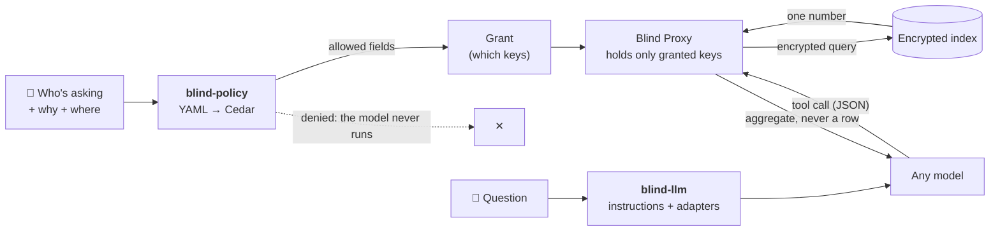

<p align="center">
  
</p>

<h3 align="center">Your agents get answers. Not records.</h3>

<p align="center">
  Blind Insight runs analytics, statistics, ML training and LLM questions on data that stays encrypted.<br/>
  The open-source pieces below let you decide what an AI agent may read, and make that decision stick with keys.
</p>

<p align="center">
  <a href="https://docs.blindinsight.io"></a>
  <a href="https://app.blindinsight.io"></a>
  <a href="https://www.youtube.com/watch?v=N9VNa7xC_48"></a>
</p>

---

## The idea in one diagram

Agent stacks already decide **whether** a call runs: identity providers, MCP gateways, policy engines. Almost nothing decides **what the call can read** once it reaches the data. That's the gap we work on.



- **Policy decides in the open.** Rules read like a compliance memo and compile to [Cedar](https://www.cedarpolicy.com). Every decision names the policy and the regulation behind it.
- **Keys enforce it.** A field the Grant doesn't list has no key on the agent's side, so a prompt-injected agent can't decrypt it.
- **The model sees numbers.** The model gets four tools, and none of them returns a record.

---

## Open source

| Repo                                                                 | What it does                                                                                                                                                        | Start here                                                                                              |
| -------------------------------------------------------------------- | ------------------------------------------------------------------------------------------------------------------------------------------------------------------- | ------------------------------------------------------------------------------------------------------- |
| 🛡️ **[blind-policy](https://github.com/blind-insight/blind-policy)** | Roles, purpose and compliance regime (GDPR, DORA, HIPAA…) compiled to Cedar, evaluated per field, output as a key Grant. AuthZEN-shaped responses. Runs in-process. | [`examples/madlibs.py`](https://github.com/blind-insight/blind-policy/blob/main/examples/madlibs.py)    |
| 🧠 **[blind-llm](https://github.com/blind-insight/blind-llm)**       | The instruction layer for asking an LLM about encrypted data: system prompt, structured-output contract, validation, adapters for OpenAI, Anthropic and Gemini.     | [`examples/quickstart.py`](https://github.com/blind-insight/blind-llm/blob/main/examples/quickstart.py) |
| 📊 **[blind-stats](https://github.com/blind-insight/blind-stats)**   | Descriptive stats, hypothesis tests, correlation, regression and drift, computed only from encrypted aggregate and count queries.                                   | [README](https://github.com/blind-insight/blind-stats#readme)                                           |
| 🤖 **[blind-ml](https://github.com/blind-insight/blind-ml)**         | Train sklearn-style models from encrypted aggregates. The fraud and breast-cancer notebooks match their plaintext counterparts.                                     | [`fraud.ipynb`](https://github.com/blind-insight/blind-ml/blob/main/fraud.ipynb)                        |

These four are MIT-licensed. Also here: **[demo-datasets](https://github.com/blind-insight/demo-datasets)** (ready-to-upload data and schemas) and **[importer](https://github.com/blind-insight/importer)** (a BigQuery → Blind Insight prototype).

---

## Try it in two minutes, no account needed

**Watch a policy say no.** A fraud analyst in Germany asks an agent for IBANs:

```bash
git clone https://github.com/blind-insight/blind-policy && cd blind-policy
pip install -e .
blind-policy check --role fraud_analyst --jurisdiction DE --schema fraud \
  --purpose fraud_investigation --prompt "show me the IBANs"
```

```jsonc
{
  "decision": false,
  "context": {
    "reason_user": {
      "en": "This asks for plaintext that could identify a person or account, which this role may not see here. Ask for encrypted aggregates instead.",
    },
    "reason_admin": {
      "en": "GDPR Art. 5(1)(c) data minimisation · DORA Art. 9(2): identifiers never leave the proxy for this role",
    },
    "policies": ["eu.fraud_analyst.identifiers"],
    "grant": null, // no keys issued, so nothing to decrypt with
  },
}
```

**See exactly what a model is told.** `blind-llm` prints the full prompt and contract without calling a model:

```bash
git clone https://github.com/blind-insight/blind-llm && cd blind-llm
pip install -e ".[openai]"
python examples/quickstart.py          # add --live to ask a real model
```

---

## Tutorials

<details>
<summary><b>1 · Gate an agent's data tools with Cedar</b> <sub>(blind-policy, no account)</sub></summary>

<br/>

Write the rule the way you'd put it on a slide:

```yaml
regime: EU
cite: GDPR Art. 5(1)(c) data minimisation · DORA Art. 9(2)
applies_to:
  jurisdictions: [DE, EU, UK]
roles:
  fraud_analyst:
    analyze: all fields # encrypted count / average / filter
    decrypt: none # data minimisation
    identifiers: never # compiles to a Cedar forbid, which beats any permit
```

Then ask what a given person may do, and get the Grant back:

```python
from blind_policy import PolicyEngine, Subject, find_schema

engine = PolicyEngine.bundled()                      # or PolicyEngine.from_dir("my-policies/")
analyst = Subject("ana", roles=["fraud_analyst"], jurisdiction="DE")
plan = engine.plan(analyst, find_schema("fraud"), purpose="fraud_investigation")

plan.queryable     # fields the agent may count / average / filter
plan.decryptable   # fields it may actually read: [] here
plan.grant()       # the key Grant for the agent's proxy

decision = engine.check(analyst, find_schema("fraud"), "fraud_investigation", "identifier_plaintext")
decision.allowed, decision.policies, decision.reasons
decision.to_authzen()                                # drop it behind any AuthZEN gateway
```

Wire it in front of your agent: `describe_schema` shows only `plan.visible` fields, `query_aggregate` refuses fields outside `plan.queryable`, and key delivery comes from `plan.grant()`. The end-to-end walkthrough is in [`examples/POC.md`](https://github.com/blind-insight/blind-policy/blob/main/examples/POC.md).

</details>

<details>
<summary><b>2 · Ask an LLM questions about encrypted data</b> <sub>(blind-llm)</sub></summary>

<br/>

```python
from blindllm import build_provider, validate_model_output

catalog = [{"dataset": "fraud-data", "schema": "train", "label": "Fraud account records"}]
client = build_provider("anthropic", api_key="...", catalog=catalog)   # or "openai", "gemini"

messages = client.build_initial_messages("Average risk for German accounts in 2024?", {})
reply = client.chat_turn(messages)    # {'response_type': 'tool_call', 'tool_name': 'describe_schema', ...}
validate_model_output(reply)          # raises if the model broke the contract

# Run the tool against your proxy, feed the result back, repeat until final_answer.
messages = client.append_tool_result(messages, reply, reply["tool_name"], reply["tool_args"], tool_result)
```

The model can call exactly four tools: `list_schemas`, `describe_schema`, `query_aggregate` and `suggest_ml_approach`. None of them returns a record, so what reaches the model provider is the prompt, the schema metadata and aggregate numbers.

</details>

<details>
<summary><b>3 · Run statistics without decrypting a row</b> <sub>(blind-stats, needs an account)</sub></summary>

<br/>

```python
from blind_stats import BIStatsSession, BlindInsightClient, resolve_target

target = resolve_target()
client = BlindInsightClient(proxy_url=target["proxy_url"], verify_ssl=target["verify_ssl"])
stats = BIStatsSession(client, org=target["org"], dataset=target["dataset"],
                       schema=target["schema"], field_domains={"risk_level": (0, 102)})

stats.mean("risk_level")                          # from encrypted aggregates
stats.median("risk_level")                        # binary search over count queries
stats.chi2_independence("fraud_type", "is_active")
stats.describe("risk_level")
```

About 60 methods, from `ttest_ind` and `anova_oneway` to `population_stability_index` and OLS regression, all built only on `aggregate` and `count` responses. A smoke test enforces that no code path asks for plaintext.

</details>

<details>
<summary><b>4 · Train a model on encrypted data</b> <sub>(blind-ml, needs an account)</sub></summary>

<br/>

<a href="https://www.youtube.com/watch?v=N9VNa7xC_48">
  
</a>

1. [Sign up](https://app.blindinsight.io) and [install the Blind Proxy](https://docs.blindinsight.io/download/) (`blind` CLI).
2. Clone [blind-ml](https://github.com/blind-insight/blind-ml), then run `pip install -r requirements.txt`.
3. Generate or [download](https://github.com/blind-insight/demo-datasets/tree/main/datasets/blind-ml) the demo data and upload it.
4. Open [`fraud.ipynb`](https://github.com/blind-insight/blind-ml/blob/main/fraud.ipynb) or [`breast_cancer.ipynb`](https://github.com/blind-insight/blind-ml/blob/main/breast_cancer.ipynb), then compare encrypted and plaintext accuracy side by side.

</details>

<details>
<summary><b>5 · Load your own data</b> <sub>(blind CLI)</sub></summary>

<br/>

```bash
blind dataset create --organization demo --name medical
blind schema create  --organization demo --dataset medical --name condition \
  --file datasets/medical/schemas/condition.json
blind record create  --organization demo --dataset medical --schema condition \
  --file datasets/medical/data/condition_data.json
```

Sample schemas and data live in [demo-datasets](https://github.com/blind-insight/demo-datasets). Setup is covered in the [Getting Started guide](https://docs.blindinsight.io/getting-started/).

</details>

---

## What is enforced where

| Control                              | Enforced by                                                                        |
| ------------------------------------ | ---------------------------------------------------------------------------------- |
| Decrypting a field                   | **Cryptography.** Only the field keys listed in the Grant reach the agent's proxy. |
| Querying a field                     | **The policy gate,** checked before each query.                                    |
| Minimum cohort size, aggregates only | **Your orchestrator,** which receives them as obligations with every decision.     |

---

## Get involved

- ⭐ **Star** the repos you'd use, so we know where to put our time.
- 🐛 **Issues and PRs** are welcome on every repo. Regime files for more jurisdictions are especially wanted.
- 🔑 **Build a proof of concept** on real encrypted data: [sign up](https://app.blindinsight.io), then read the [docs](https://docs.blindinsight.io).
- 🌐 More at **[blindinsight.com](https://blindinsight.com)**.

<sub>The regime files in blind-policy are worked examples of how to encode rules, not legal advice.</sub>
